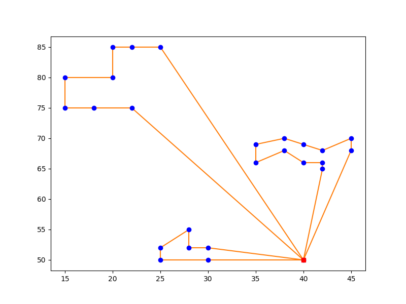

# CVRPTW by solvers

* A solution to the Capacitated Vehicle Routing Problem with Time Window by GUROBI and CPLEX.

* Thanks to [Simone Richetti](https://github.com/SimoneRichetti) for the idea of organizing and structuring input data, visit his repo [here](https://github.com/SimoneRichetti/VRPTW-Column-Generation).

<figure>
    
    <figcaption>Routing solution of instance C101-25.</figcaption>
</figure>

